# gCore controlled ESP32-CAM tank

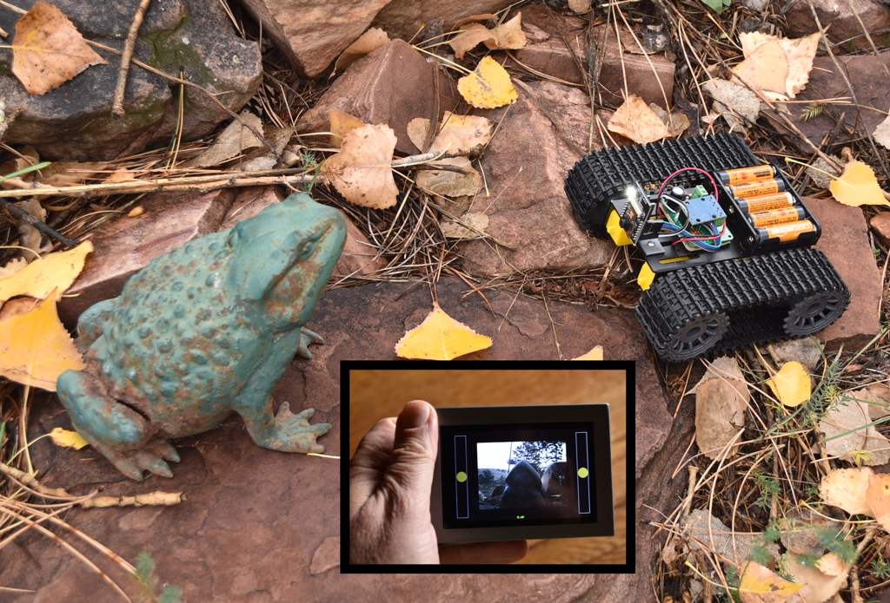

A simple remote controlled tank (or car) based on the ubiquitous ESP32-CAM module using [gCore](https://github.com/danjulio/gCore) as a hand-held controller with live video feed.

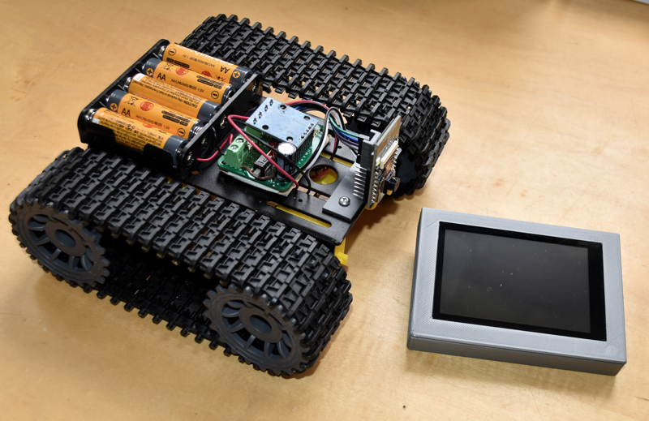

The vehicle consists of the following parts.  I used inexpensive components found on Amazon but any number of bodies, motors and drivers can be substituted.

1. AI-Thinker ESP32-CAM - OV2640 sensor, ESP32, PSRAM
2. Vehicle Body - Driven with two DC brushed motors, one on each side.  Can be a tank or car style.  My [tank](https://www.amazon.com/dp/B09TFSKQ7J) claims to have 3-6V motors (but they really need 6+ volts to move the tank).
3. Dual H-Bridge Driver - Matched to the power supply and motors and capable of being driven by 3.3V logic.  My HiLetgo [board](https://www.amazon.com/dp/B00M0F243E) uses a L9110S H-bridge chip.  See note below about removing some pull-up resistors if you use this board.
4. Battery Pack - Capable of powering the vehicle but within the range of the ESP32-CAM 5V input (feeding an AMS1117 regulator with a probable max of 12V).  I used a 5 AA pack.
5. Misc components - Power switch, Bulk Capacitor (I used 1000 uF), a pair of 0.1 uF/50V caps for the motors, proto board, hook-up wire and dupont cables, misc mounting hardware.
6. gCore (from [Group Gets](https://www.groupgets.com))
7. [Optional] 3D printed mount for ESP32-CAM

Code for the ESP32-CAM and gCore are ESP32 Arduino sketches.  I used Arduino 1.8.19 with the ESP32 1.0.6 package along with several libraries that may be found in the gCore repository or other of my repositories.

The ESP32-CAM advertises a WiFi SSID that the gCore connects to.  The system uses a socket to transfer a mjpeg video stream and control information.  The dual-touch capability of the gCore touchscreen is used to provide two sliders, one for each motor, with spring-back on release.  The gCore power button short-press is used to turn on and off the ESP32-CAM flash LED acting as a headlight.

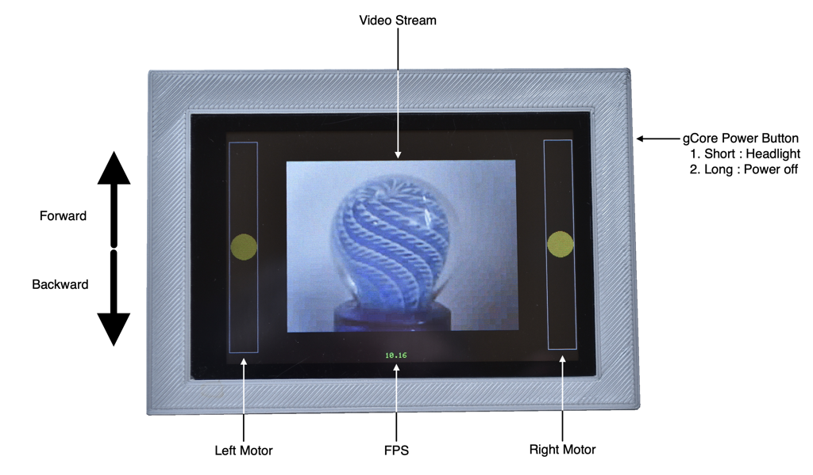

This repository contains the Arduino sketches and an OpenSCAD design for the ESP32-CAM mount.

## Programming Notes

1. Configure the Arduino environment for an ESP32 WROVER module and set the serial monitor to 115200 baud.
2. Follow the many online guides for loading the ```esp32_cam_tank``` sketch into the ESP32-CAM.  This requires using an external 3.3V USB-UART board or cable connected to the ESP32-CAM TX/RX/5V/GND lines.  Ground IO0 when applying power to enter bootloader mode.  Program the ESP32-CAM before connecting to the tank electronics.
3. Turn on gCore before loading the ```gcore_tank_controller``` sketch.  Select the serial port associated with gCore when it is powered.


## Wiring Diagram

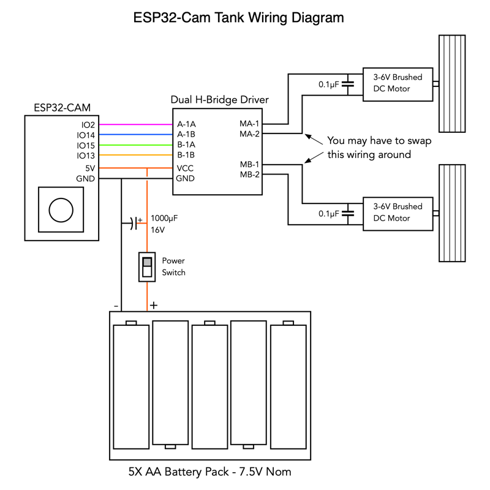
Spare GPIO signals on the ESP32-CAM are used to generate 25 kHz PWM signals to control the speed of each motor (a pair for each motor).  You may have to swap either the motors or their wiring connections to the Dual H-Bridge driver after you assemble the vehicle.  It will be obvious when you first try to drive it :-)

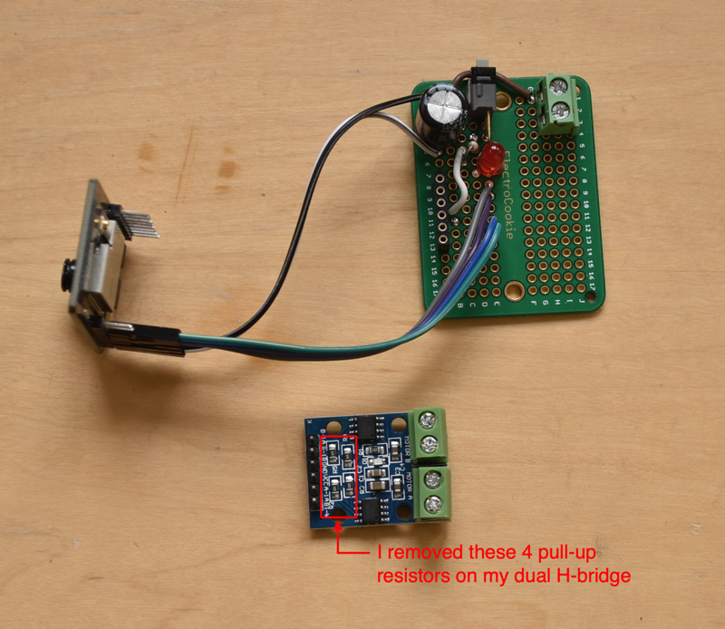
The Dual H-Bridge Driver includes four 10-kohm resistors on the inputs connected to VCC.  Since VCC is connected to the 7.5V battery pack these pull-ups will strain the ESP32 GPIO pads.  I removed the four resistors.  A side-effect is that the motors might run for a second before the code starts running on the ESP32 and sets all four outputs low initially.

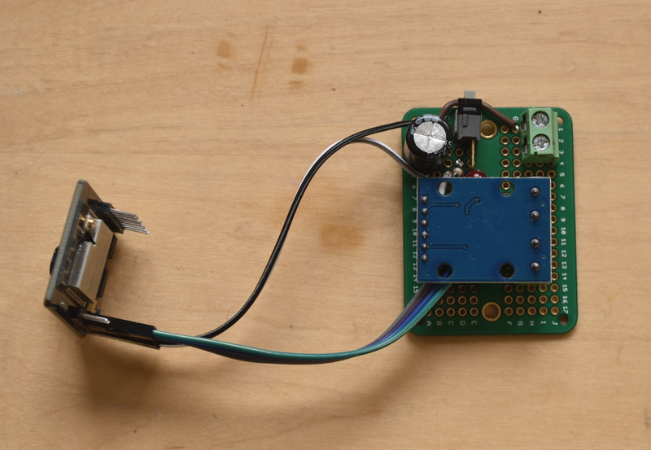

## ESP32-CAM Mount
I designed and 3D printed a very simple mount to hold the ESP32-CAM perpendicular to the tank mounting plate so the camera (and LED) can face forward.

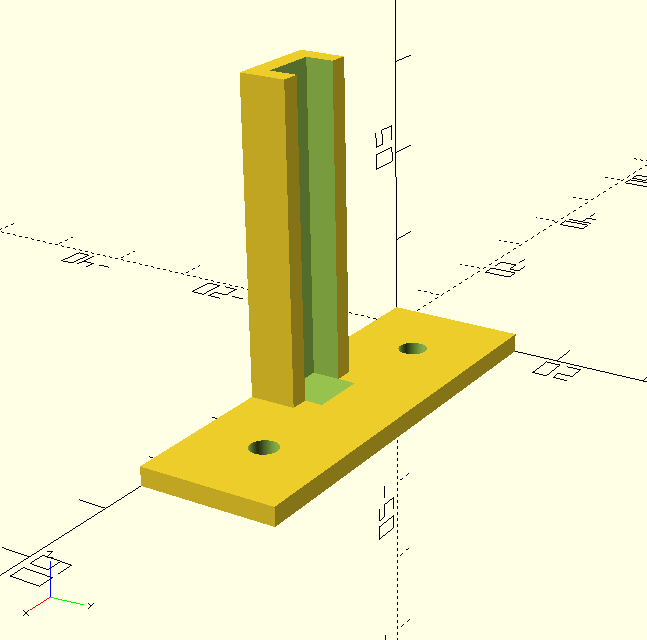

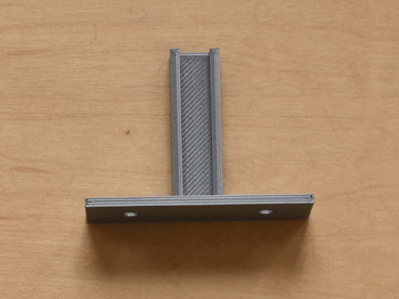

## Assembly Pictures

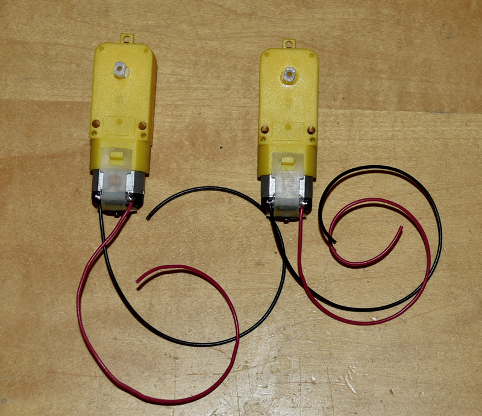
I added a 0.1 uF (50V) capacitor across the terminals of the motors to reduce electrical noise.  You can see them under the restraining straps.

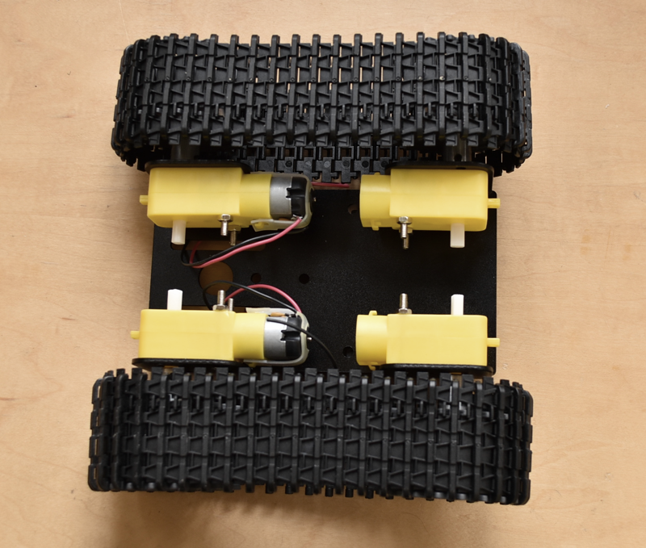
The tank kit had four motors with gear assemblies.  I used all four gear assemblies but removed two motors.

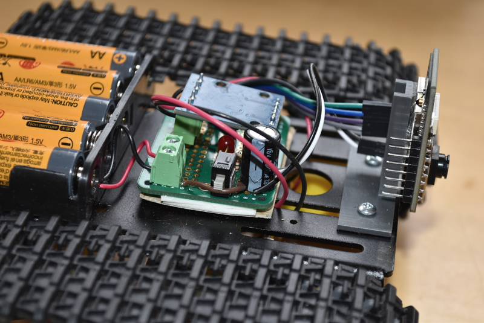
Both the battery pack and and circuit board were attached to the vehicle body using strong 3M double sticky tape.  I also taped a piece of cardboard under the circuit board to prevent shorts.  The ESP32-CAM Mount is screwed to the vehicle body and the ESP32-CAM is stuck to it using double sticky tape on the ESP32 module.

## Final Comments
My build is far from optimized.  The motors are underpowered for the vehicle and require high PWM values (> 50%) to even start moving.  You can see a map function in the ```motor_set``` function (```motors``` tab in the ```esp32_cam_tank``` sketch) where I map the incoming speed value to smaller range of the PWM period (speed of 32-255 to 10-bit PWM values 640-1023).  Probably a more expensive vehicle base and matching drivers and power supply would work better.

Decoding the mjpg stream is expensive on the gCore's ESP32 and variable depending on how complex the image is.  I generally got less than 12 FPS.  It is clear that many things affect the WiFi connection occasionally slowing the connection further.  This makes using the video feed more difficult to use when driving the vehicle out of sight.  

Despite these short comings this project was a fun build and I hope gives you ideas for your own builds and code to hack away at.